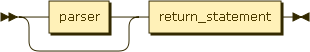
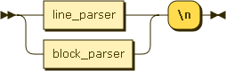
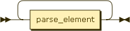
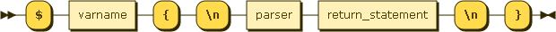
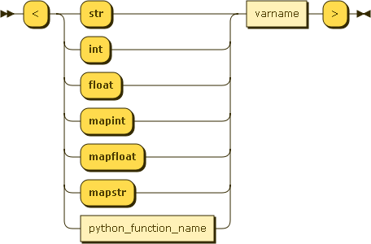
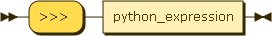
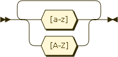

Python Input Parser
===================

This implements a general parsing language to parse input from `stdin`, to be
used in programming contests. This is intended to be compatible with both Python
2 and Python 3.

How to use
----------

To parse input, call the function: `parse(parse_string)`. This returns a data
structure as defined in `parse_string`. If `parse` is imported from the module
and the `parse_string` contains a user-defined function, call
`parse(parse_string, globals())`. Every parse string must end with a return
statement (think of it as being enclosed in a outer block that is always
executed once).

Example
-------
Lets say you are given the following description of the input:

> The first line of the input gives the number of test cases, **T**. **T** test
> cases follow. Each case begins with a line containing an integer **N**,
> denoting the number of lines in that case. The next N lines each describe one
> subcase containing integers **A** and string **B**.

This is an example of a possible input from `stdin`:

```
2
3
1 q
5 w
7 e
2
1 r
2 t
```

We wish to parse this into the following python data-structure:

```python
[[{'A': 1, 'B': 'q'}, {'A': 5, 'B': 'w'}, {'A': 7, 'B': 'e'}],
 [{'A': 1, 'B': 'r'}, {'A': 2, 'B': 't'}]]
```

This is how it is done:

```python
from parser import parse

parse_string = \
"""
<int t>
$t{
<int n>
$n{
<int a> <str b>
>>> {'A' : $a, 'B': $b}
}
>>> list(%n)
}
>>> list(%t)
"""

data = parse(parse_string)
```

Syntax Diagram
--------------

      <p style="font-size: 14px; font-weight:bold"><a name="parse_string">parse_string:</a></p><map name="parse_string.map">
         <area coords="49,1,109,33" href="#parser" shape="rect" title="parser">
         <area coords="149,1,281,33" href="#return_statement" shape="rect" title="return_statement"></map><p>
         <div class="ebnf"><pre><a href="#parse_string" title="parse_string">parse_string</a>
         ::= <a href="#parser" title="parser">parser</a>? <a href="#return_statement" title="return_statement">return_statement</a></pre></div>
      </p>
      <p>no references</p><br><p style="font-size: 14px; font-weight:bold"><a name="parser">parser:</a></p><map name="parser.map">
         <area coords="49,1,139,33" href="#line_parser" shape="rect" title="line_parser">
         <area coords="49,45,149,77" href="#block_parser" shape="rect" title="block_parser"></map><p>
         <div class="ebnf"><pre><a href="#parser" title="parser">parser</a>   ::= ( <a href="#line_parser" title="line_parser">line_parser</a> | <a href="#block_parser" title="block_parser">block_parser</a> ) '\n'</pre></div>
      </p>
      <p>referenced by:
         <ul>
            <li><a href="#block_parser" title="block_parser">block_parser</a></li>
            <li><a href="#parse_string" title="parse_string">parse_string</a></li>
         </ul>
      </p><br><p style="font-size: 14px; font-weight:bold"><a name="line_parser">line_parser:</a></p><map name="line_parser.map">
         <area coords="49,17,163,49" href="#parse_element" shape="rect" title="parse_element"></map><p>
         <div class="ebnf"><pre><a href="#line_parser" title="line_parser">line_parser</a>
         ::= <a href="#parse_element" title="parse_element">parse_element</a>+</pre></div>
      </p>
      <p>referenced by:
         <ul>
            <li><a href="#parser" title="parser">parser</a></li>
         </ul>
      </p><br><p style="font-size: 14px; font-weight:bold"><a name="block_parser">block_parser:</a></p><map name="block_parser.map">
         <area coords="77,1,151,33" href="#varname" shape="rect" title="varname">
         <area coords="275,1,335,33" href="#parser" shape="rect" title="parser">
         <area coords="355,1,487,33" href="#return_statement" shape="rect" title="return_statement"></map><p>
         <div class="ebnf"><pre><a href="#block_parser" title="block_parser">block_parser</a>
         ::= '$' <a href="#varname" title="varname">varname</a> '{' '\n' <a href="#parser" title="parser">parser</a> <a href="#return_statement" title="return_statement">return_statement</a> '\n' '}'</pre></div>
      </p>
      <p>referenced by:
         <ul>
            <li><a href="#parser" title="parser">parser</a></li>
         </ul>
      </p><br><p style="font-size: 14px; font-weight:bold"><a name="parse_element">parse_element:</a></p><map name="parse_element.map">
         <area coords="99,265,263,297" href="#python_function_name" shape="rect" title="python_function_name">
         <area coords="303,1,377,33" href="#varname" shape="rect" title="varname"></map><p>
         <div class="ebnf"><pre><a href="#parse_element" title="parse_element">parse_element</a>
         ::= '&lt;' ( 'str' | 'int' | 'float' | 'mapint' | 'mapfloat' | 'mapstr' | <a href="#python_function_name" title="python_function_name">python_function_name</a> ) <a href="#varname" title="varname">varname</a> '&gt;'</pre></div>
      </p>
      <p>referenced by:
         <ul>
            <li><a href="#line_parser" title="line_parser">line_parser</a></li>
         </ul>
      </p><br><p style="font-size: 14px; font-weight:bold"><a name="return_statement">return_statement:</a></p><map name="return_statement.map">
         <area coords="103,1,243,33" href="#python_expression" shape="rect" title="python_expression"></map><p>
         <div class="ebnf"><pre><a href="#return_statement" title="return_statement">return_statement</a>
         ::= '&gt;&gt;&gt; ' <a href="#python_expression" title="python_expression">python_expression</a></pre></div>
      </p>
      <p>referenced by:
         <ul>
            <li><a href="#block_parser" title="block_parser">block_parser</a></li>
            <li><a href="#parse_string" title="parse_string">parse_string</a></li>
         </ul>
      </p><br><p style="font-size: 14px; font-weight:bold"><a name="varname">varname:</a></p><p>
         <div class="ebnf"><pre><a href="#varname" title="varname">varname</a>  ::= [a-zA-Z]+</pre></div>
      </p>
      <p>referenced by:
         <ul>
            <li><a href="#block_parser" title="block_parser">block_parser</a></li>
            <li><a href="#parse_element" title="parse_element">parse_element</a></li>
         </ul>
      </p><br><hr>
      <p>
         <table border="0" class="signature">
            <tr>
               <td style="width: 100%">&nbsp;</td>
               <td valign="top">
                  <nobr class="signature">... generated by <a class="signature" href="http://railroad.my28msec.com/" name="Railroad-Diagram-Generator" title="http://railroad.my28msec.com/">Railroad Diagram Generator</a></nobr>
               </td>
               <td></td>
            </tr>
         </table>
      </p>

Specification
-------------

There are two types of parsers, line parser and block parser. There are also two
types of variables, normal variables and iterable variables.

### Line Parser Syntax

A line parser will read in one line and try to bind normal variables to the data
read from the input. To bind more than one variable, the data and the line
parser entries must be separated by spaces.

Each entry in a line parser must have the following form:
```
<type varname>
```
Where `varname` must be a valid normal variable name.

`type` is a function that converts a string into a certain type. Functions
supported by line parser are:

| Name       | Converted to                               |
|------------|--------------------------------------------|
| `str`      | String                                     |
| `int`      | Integer                                    |
| `float`    | Float                                      |
| `mapint`   | List of integers delineated by whitespace  |
| `mapfloat` | List of floats delineated by whitespace    |
| `mapstr`   | List of strings delineated by whitespace   |


### Block Parser Syntax

Every block parser must start with `$varname{`, where `varname` is the name of
an integer-valued normal variable. It must end with one return statement,
followed by `}` on a new line.

A block parser starts with an initializing integer normal variable. The value of
the variable is looked up at the start of the execution of the block parser,
which is the number of times the block can be executed. The block parser then
binds an iterable variable with the same name as the initializing variable. The
iterable variable points to an iterator, which yields the result of each
iteration of the block, as defined by the return statement. However, each block
is not lazily evaluated.

### Return Statement Syntax

A return statement starts with `>>> `, followed by a python expression. The
result from evaluating the python expression is what each iteration of the block
should yield. The python expression can use normal and iterable variables, as
well as any function or variable defined in the global frame of the program.

### Normal Variables

A normal variable starts with a `$`, followed by its name, which must be all
letters. All normal variables are mutable by executing line parsers.

### Iterable Variables

An iterable variable starts with a `%` followed by its name, which must be all
letters. During execution, a iterable variable is replaced with an iterator
generated from executing its block.
